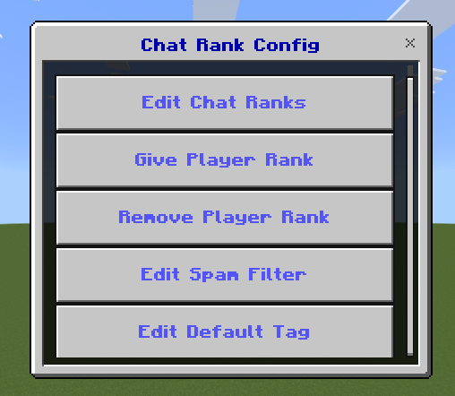
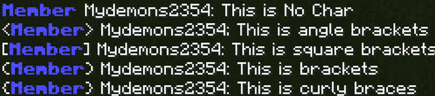
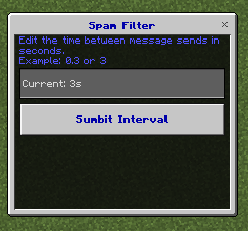
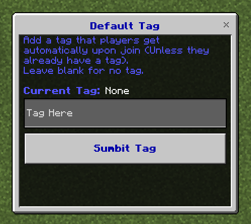

# Chat Ranks & Anti-Spam Addon

<p align="center">
  
</p>

Welcome to the **Chat Ranks Anti-Spam** addon! This tool allows you to add highly configurable custom ranks to yourself or other players. You can even set default ranks that new players receive automatically when joining for the first time.

🚀 **[Download the Latest Release Here!](https://github.com/mydemons2354/chatranks-anti-spam-v2/releases)**

> ⚠️ **Important Requirement:** Make sure the **Beta-APIs** experiment is enabled in your world settings before using this addon!

---

## 📦 Downloads & Installation

To get the latest verified version of the addon:
1. Head over to the **[GitHub Releases Page](https://github.com/mydemons2354/chatranks-anti-spam-v2/releases)**.
2. Download the direct `.mcaddon` file from the assets list.
3. Open the file to automatically import it into Minecraft.
4. Activate both the **Resource Pack** and **Behavior Pack** in your world settings.

---

## 🛠️ How to Create a Chat Rank

Chat ranks are managed using in-game tags. 

1. Use the standard Minecraft `/tag` command.
2. Prefix the tag with `rank:`.
3. Anything added after the colon (`:`) will display as the player's chat rank.

*Note: Color codes are supported and fully valid!*

### Example
To create a light blue, bold "Owner" rank, look at the example command below:

```text
/tag @s add "rank:§l§bOwner"
```


---

## ⚙️ Configuration

To open the configuration interface, type the following command directly into the chat:
```text
/cr:config
```
🔒 *Security Note: Only the world host can access the configuration menu.*

<p align="left">
  
</p>

---

## ✨ Config Features

### 1. Edit Chat Ranks (Brackets Style)
You can customize the style of the characters that display before and after the chat rank text.

*   **Available Options:** `No Char`, `<>`, `[]`, `()`, `{}`

#### Style Preview:


### 2. Edit Anti-Spam Duration
Modify the safety cooldown window between sent messages to block spam bots and flooding.
*   **Default Cooldown:** 0.5 seconds.

<p align="left">
  
</p>

### 3. Default Tags
Configure a default tag that automatically gets assigned to new players the exact moment they join your world for the first time! Leave it blank if you do not want a default tag assigned.

<p align="left">
  
</p>
